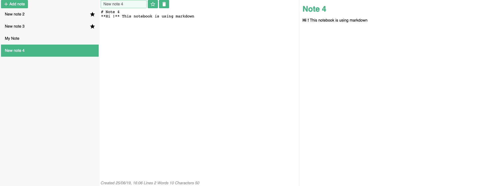

# Vue Markdown Notebook

### [Click Here for Demo](https://omertarik96.github.io/vue-markdown-notebook/index)


## Features

- The notebook app will allow the user to write notes in markdown
- The markdown will be previewed in real time
- The users will be able to add as many notes as they want
- The notes will be restored the next time the user visits the app


## Project setup
```
yarn install
```

### Compiles and hot-reloads for development
```
yarn run serve
```

### Compiles and minifies for production
```
yarn run build
```

### Run your tests
```
yarn run test
```

### Lints and fixes files
```
yarn run lint
```

### Customize configuration
See [Configuration Reference](https://cli.vuejs.org/config/).
